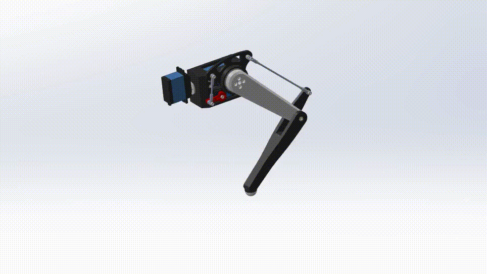
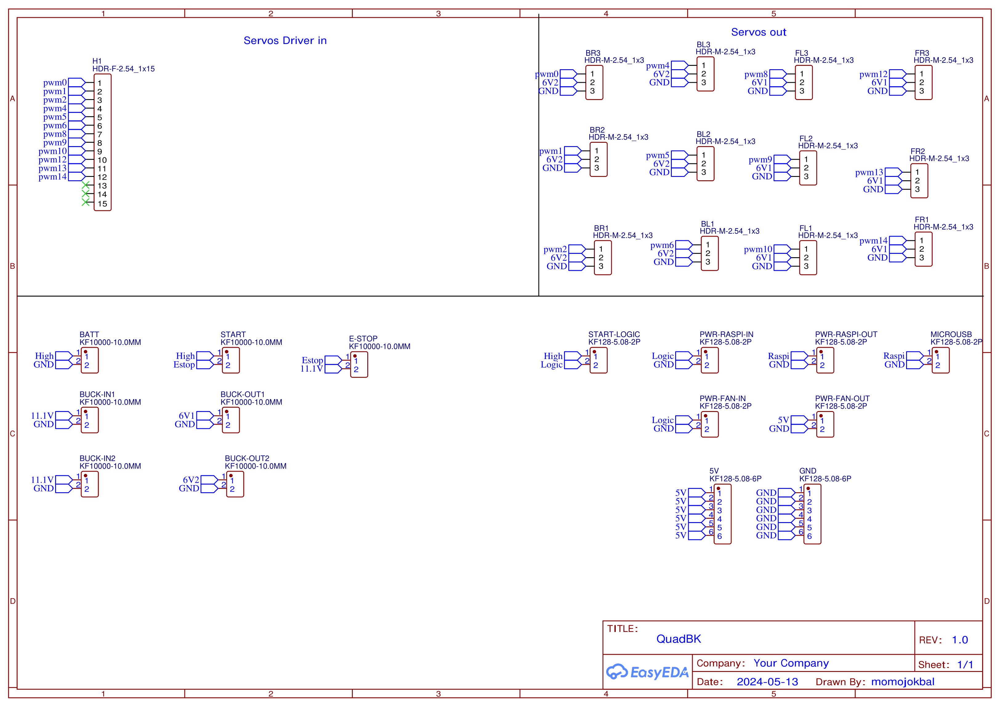
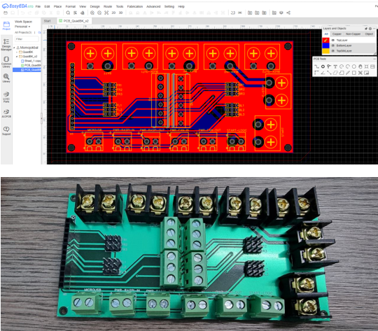

# QuadBK quadruped robot
This repository contains all files and documents for the QuadBK robot platform. The robot was constructed for my Capstone Project Course at Ho Chi Minh City University of Technology (HCMUT). All codes and documentation will be updated soon!

The robot can be seen working in [this video](https://youtu.be/aWlsWf3MUjA).

## Building the robot
The leg assembly is built by following [this drawing](drawings/2_BL-Leg-Module.pdf). To customize your design, refer to [this leg linkage construction](https://geogebra.org/classic/zdsb82sw).

The whole body assembly is built by following [this drawing](drawings/3_QuadBK.pdf).

## Electrical components
The breakout PCB is designed in EasyEDA. The schematic drawing is presented:

The final board:

## Uploading the code
To be updated
